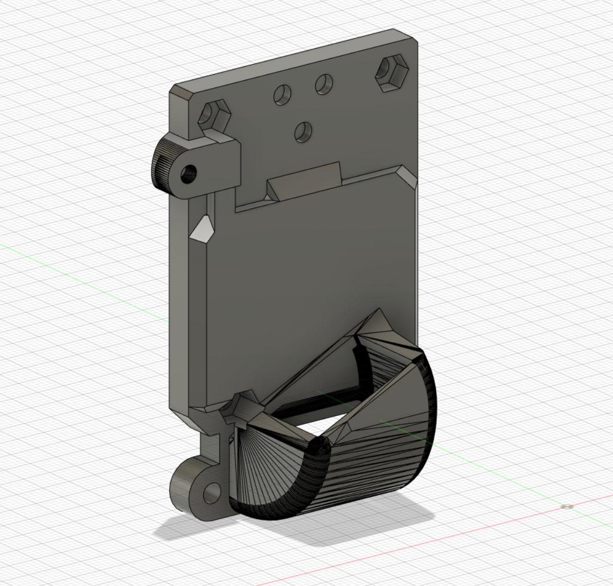

> Created by: [Igor Chudy](https://github.com/vellkan)

## Description
This is a modification of the back_corexy.stl for Ender5 family printers.
It is a slim version of default back to avoid vertical elements in printer frame.

## Compatible EVA version
2.4.0 -> 2.4.x

## Changelog:
v1.0 06/02/2022 Main Release

## Related EVA parts
This replaces the back_corexy

## BOM
| No | Qty | Name                                           | Printable |
| -- | --- | ---------------------------------------------- | --------- |
| 1  | 1   | eva-2.4-ender-5-flat-back                 | [Yes](stl/eva-2.4-ender-5-flat-back.stl) |

## To Do
Add new cable mount
